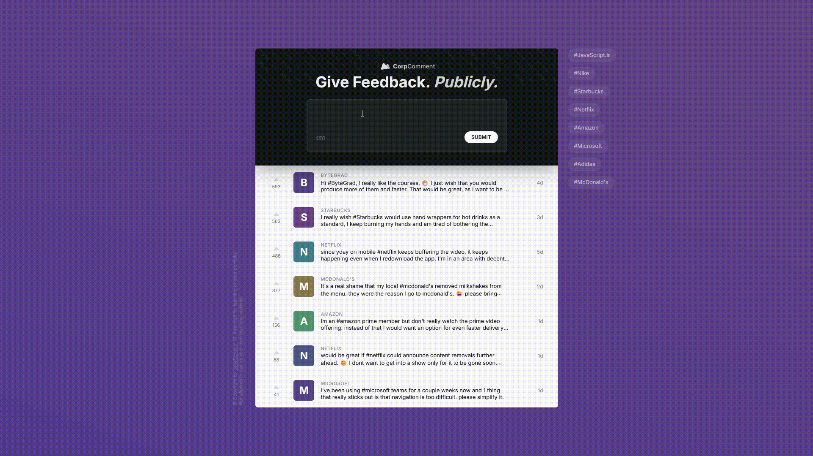

# 💼 CorpComment - Interactive Feedback Board

A full-stack, dynamic feedback application built with vanilla JavaScript. Users can submit public feedback for companies, view a live feed, and interact with a modern, responsive UI that includes real-time validation and API integration.



> **Note:** This project is part of my main learning repository.
> **View all my projects & commit history:** [github.com/AmirPhpDeveloper/learning-js](https://github.com/AmirPhpDeveloper/learning-js)

## ✨ Features

- **Dynamic Feedback Submission:** Submit feedback with company hashtags (e.g., `#JavaScriptir`).
- **Real-time Validation:** Instant UI validation for hashtag presence and text length.
- **Live API Integration:** Fetches and displays existing feedbacks from a live API endpoint.
- **Modern UI/UX:** Clean, responsive design with smooth animations and hover effects.
- **Character Counter:** Live character countdown from 150.
- **Hashtag Filtering:** Interactive sidebar hashtags for filtering content (UI ready).
- **Persistence:** All data is stored and retrieved from a remote database via API.

## 🛠️ Built With

- **Vanilla JavaScript (ES6+)** - For application logic, DOM manipulation, and API calls
- **HTML5** - Semantic markup and structure
- **CSS3** - Modern styling with Flexbox, Grid, animations, and full responsiveness
- **RESTful API** - For full CRUD operations (Create, Read from `https://bytegrad.com`)
- **Font Awesome** - For modern icons
- **Google Fonts (Inter)** - For clean, modern typography

## 🚀 Getting Started

### Prerequisites

All you need is a modern web browser and a local server to avoid CORS issues when fetching from the API.

- Google Chrome, Firefox, Safari, or Edge

### Installation & Running

1.  **Clone the repository:**
    ```bash
    git clone https://github.com/AmirPhpDeveloper/corp-comment-app.git
    ```
2.  **Navigate to the project directory:**
    ```bash
    cd corp-comment-app
    ```
3.  **Run a local server:**  
    _(Essential for API requests to work properly)_

    ```bash
    # Using Python (if installed)
    python -m http.server 8000

    # Or using Node.js http-server
    npx http-server

    # Or using Live Server extension in VS Code
    ```

4.  **Open your browser** and go to `http://localhost:8000` (or the port your server uses).

## 📖 How to Use

1.  **Submit Feedback:**

    - Type your feedback in the text area.
    - **Include a company hashtag** (e.g., `Great service! #JavaScriptir`).
    - Click "Submit" or press Enter. The feedback will be added to the public list.

2.  **View Feedbacks:** The main list automatically loads and displays existing feedbacks.

3.  **Interact:**

    - **Upvote:** Click the upvote button on any feedback.
    - **Expand:** Click on a feedback item to expand and read the full text.

4.  **Filter (UI Ready):** Click on any hashtag in the right sidebar to filter feedbacks (filtering logic can be implemented).

## 🔧 Project Structure

```
corp-comment-app/
├── index.html          # Main HTML structure
├── style.css           # All styles and responsive layout
├── script.js           # Main application logic and entry point
├── helpers.js          # Modular helper functions (API calls, validation, DOM creation)
├── README.md           # This file
└── demo.gif            # Application demo and usage
```

### Key Modules (`helpers.js`):

- **`validation()`:** Handles UI validation states and animations.
- **`createFeedEL()`:** Creates and returns DOM elements for new feedback items.
- **`handleText()`:** Parses feedback text to extract hashtag, company name, and badge letter.
- **`getFeedbacks()`:** Fetches feedback data from the API and renders the list.
- **`createFeedBack()`:** Posts new feedback to the API and updates the UI.

## 🧠 Concepts Practiced

This advanced project demonstrates practical use of:

- **API Integration:** Consuming a RESTful API with `fetch()` for both GET and POST requests.
- **ES6 Modules:** Modular JavaScript architecture using `import/export`.
- **Asynchronous JavaScript:** Working with Promises and handling API responses.
- **Advanced DOM Manipulation:** Dynamically creating and inserting complex HTML structures.
- **Form Validation:** Real-time input validation and user feedback.
- **Event Delegation:** Efficiently handling events on dynamically created elements.
- **CSS Architecture:** BEM naming convention, responsive design, and complex animations.
- **Code Organization:** Separating concerns into logical modules and functions.

## 🔮 Potential Enhancements

- Implement the filtering functionality for sidebar hashtags.
- Add functionality for the upvote buttons to persist data.
- Add loading states for better UX during API calls.
- Implement DELETE or EDIT functionality for feedbacks.

## 🤝 Contributing

This is a learning project, but ideas and suggestions are always welcome! Feel free to fork the repository and submit a pull request.

---

## 📜 License

This project is open source and available under the [MIT License](LICENSE).

**Happy Coding!** 🚀
